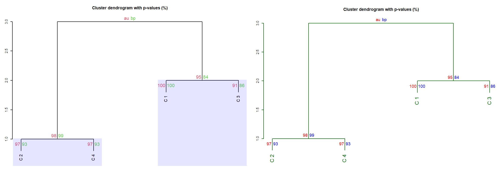
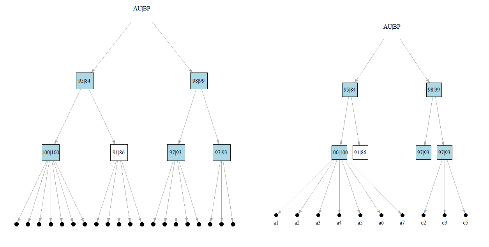

# LVPV
AU p-values estimation for community detection with leading eigenvector

This code is supplementary material to the article on the *leading eigenvector* algorithm for community detection. 
lvpv contains functions that allow (i) to find approximately unbiased (AU) p-values of the communities found by the leading eigenvector algorithm and (ii) visualise the results as either dendrogram or binary graph. 
With this functions, from a numeric dataset a complete graph is built (via *igrpaph* \[[3](https://igraph.org/r/)\] package) with weights calculated from the correlation matrix of the data (see *LModularity* function from *evolQG* \[[4](https://cran.r-project.org/web/packages/evolqg/index.html)\] package for another example of such transformation). The leading eigenvector algorithm is applied, and then Shimodaira's  multiscale bootstrap \[2\] procedure (based on the *pvclust* \[[1](https://cran.r-project.org/web/packages/pvclust/index.html)\] package implementation) is conducted to estimate the p-values of the detected modules.
Additional feature allows to access naive bootstrap estimates for the modularity mean, standard deviation and quantiles of desired level. Full summary of the results can be obtained with the `PV.summary` function.

## Examples

### Finding AU and BP p-values estimations

The bootstrap procedure and all further calculations are conducted by `PV.complete` function. It returns a list with all obtained results and used parameters. Main information can be accessed with `PV.summary` function (applied to the `PV.complete` output).
```
source("lvpv.r")

# bootstrap and p-value estimation
pvTD = PV.complete(TestData, iseed=767)
PV.summary(pvTD)

pvD2 = PV.complete(Data2)
PV.summary(pvD2) 
```
Different options for correlation are set with `method` and `use` parameters. Parameter `q.cut` cuts off the lower values (with diagonal excluded) of the squared correlation matrix at the specified level when creating a graph. By default, a correlation matrix with any negative values is squared, but also option `square = FALSE` is available. It sets gauss transformation of the correlation matrix (on its own, gauss transformation can be set by `gauss = TRUE`).
```
# built graph with non-squared gauss-transformed correlation matrix
pvTD.n = PV.complete(TestData, iseed=767, square=FALSE)
PV.summary(pvTD.n)
```
Another available option is to create graph with loops by using diagonal elements of the correlation matrix (as in *LModularity*):
```
pvTD.diag = PV.complete(TestData, iseed=767, q.cut=0, diag=TRUE)
PV.summary(pvTD.diag)
```

### Visualization
There are two ways to visualise results. `PV.dendro`, `PV.text`, and `PV.rectangle` functions provide dendrogram plots with annotations like those of the *pvclust* package, `PV.graph` and `PV.graph.highlight` create and plot binary graph with labeled nodes. Both plot functions use standard visual parameters (for dendrograms, see also *plot.pvclust* help).
```
# DENDROGRAM
PV.dendro(pvTD, print.pv = F); PV.text(pvTD) # dendrogram with added AU p-values
# Fig. 2, right
PV.dendro(pvD2, col = "darkgreen", col.pv = c(au = "red", bp = "blue"), lwd = 2, cex.pv = 1.2, cex = 1.5)
# highlight modules with significant (e.g. AU p-value >= .95) highlighted with rectangles (Fig 2, left)
PV.dendro(pvD2); PV.rectangle(pvD2, border = "blue", col = rgb(red=0, green=0, blue=1, alpha=0.1)) 
```


Information on the depicted clusters is contained within `PV.summary` output:
>Clusters:
>
>C1: a1 a2 a3 a4 a5 a6 a7  
>C2: c1 c4 c6 c7 c8  
>C3: b1 b2 b3 b4 b5  
>C4: c2 c3 c5

```
# GRAPH
plot(PV.graph(pvTD)) # graph with p-values
PV.graph.highlight(pvTD, col="lightblue") # graph with highlighted modules of AU p-value >= .95
```
In graphs, objects nodes can be hidden with `members`; labels for the objects can be fully or partially removed from the graph with `m.labels` or `which` parameters respectfully:
```
PV.graph.highlight(pvD2, col="lightblue", members = F) # hide nodes
PV.graph.highlight(pvD2, col="lightblue", m.labels = F) # hide labels (Fig. 2, left)
# show labels for the  1st and the 4th modules (Fig. 2, right):
PV.graph.highlight(pvD2, col="lightblue", which = c(1,4))
```



## References
1. R. Suzuki, H. Shimodaira, *Pvclust: an R package for assessing the uncertainty in hierarchical
clustering, Bioinformatics*, 22 (2006), no. 12, 1540–1542.
2. H. Shimodaira, *Approximately unbiased tests of regions using multistep-multiscale bootstrap
resampling*, The Annals of Statistics, 32 (2004), 2616–2641.
3. G. Csardi, T. Nepusz, *The igraph software package for complex network research*, InterJournal
(2006), Complex Systems
4. D. Melo, G. Garcia, A. Hubbe, A. P. Assis and G. Marroig, *EvolQG - An  package for evolutionary quantitative genetics* F1000Research, 4 (2015): 925
